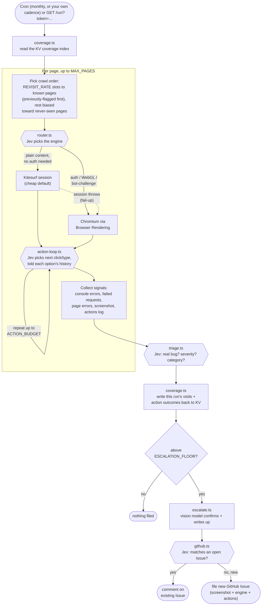

# cloudflare-web-qa-jev-agent

[](https://deploy.workers.cloudflare.com/?url=https://github.com/Clawbuilders/cloudflare-web-qa-jev-agent)

A Cloudflare Worker that acts like a QA tester on a web app — not just
crawling and reading, but clicking through forms and buttons — using
[`typesafe/jev`](https://developers.cloudflare.com/ai/models/typesafe/jev/)
(Cloudflare's decision model — fast, cheap, calibrated yes/no,
multiple-choice, and score judgments) for every decision along the way:
which browser engine a page needs, what to click next, whether a finding is
real, and whether it's a duplicate. A vision model confirms the real findings
and writes them up as deduped GitHub Issues. Built as a bonus track for
ClawBuilders Episode 5, alongside
[`cloudflare-code-reviewer`](https://github.com/Clawbuilders/cloudflare-code-reviewer)
and [`clawbuilders-story-agent`](https://github.com/Clawbuilders/clawbuilders-story-agent).

It's the web equivalent of what a mobile agent like Google's ARTEMIS does for
Android — natural-language-driven autonomous testing — except this one runs
entirely on Cloudflare and writes its findings straight to GitHub. Formerly
`web-qa-jev-agent`; renamed and substantially redesigned as part of
`docs/phases/phase-51-web-qa-agent-tiered-browser-pipeline.md` in the main
app repo, which has the full architecture writeup and the alternatives
(Stagehand, browser-use, Skyvern, WebMCP) considered and why.

## How it works



```
Cron Trigger (monthly by default, change it to fit your project) or GET /run?token=...
  → Coverage read (src/coverage.ts): one KV read of everything this Worker
    has crawled before. REVISIT_RATE of MAX_PAGES gets reserved for
    regression-checking known pages (ones that previously found something
    first, then the stalest); the rest is biased toward pages never seen
    before, falling back to known ones only if the site doesn't have
    enough fresh links to fill the budget.
  → For each page (up to MAX_PAGES, in that coverage-aware order):
      1. Engine router (src/router.ts): one Jev call picks Kitesurf (cheap
         default, ~3-7x less CPU/memory than Chromium) or Chromium via
         Browser Rendering (escalation) — auth sessions, WebGL/canvas/video,
         or bot-challenge domains route to Chromium. A Kitesurf session that
         actually throws fails up to Chromium regardless of what the router
         guessed, so a wrong guess is never fatal.
      2. Action loop (src/action-loop.ts): ports the core idea from
         browser-use/jev-ultrafast — one DOM snapshot of visible interactive
         elements per step, one Jev call picks the next indexed action
         (click / type / "done"), up to ACTION_BUDGET steps. Each option's
         description carries its history from the coverage index (never
         tried / tried N times and clean / tried before and found
         something), and Jev is told to prefer the genuinely new but not
         exclusively — a previously-clean element can still break from an
         unrelated change, so it's worth an occasional re-check, and a
         previously-flagged element gets real priority to verify the fix
         held. This is what actually exercises forms and buttons instead
         of only following <a href> links.
      3. Collect signals: console errors, failed network requests, page
         errors, a text excerpt, a screenshot, and a log of what the action
         loop did.
  → Fast triage: one parallel typesafe/jev call per page — "is this a real
    bug?" (Noul), "how severe?" (Score), "what kind?" (Choice) — now informed
    by what the action loop actually attempted, not just passive signals.
  → Coverage write (src/coverage.ts): this run's visits and action outcomes
    get merged back into the KV index before anything gets filed, so the
    memory update doesn't depend on the rest of the run succeeding.
  → Escalation gate: only pages Jev flags above ESCALATION_FLOOR go further
  → Confirm + draft: a vision model (@cf/meta/llama-3.2-11b-vision-instruct)
    looks at that page's screenshot and writes up the finding
  → Dedup: another Jev call — does this match an already-open Issue, or is
    it new?
  → Write-back: new findings become a GitHub Issue (screenshot, engine used,
    and actions attempted all included for transparency); repeat findings
    get a comment on the existing Issue
```

### Why Jev *and* a vision model — not just one

[`typesafe/jev`](https://developers.cloudflare.com/ai/models/typesafe/jev/)
is **text-only** — its own docs are explicit that images, audio, and video
aren't supported. It can't tell you a layout is broken from a screenshot, and
it can't drive a browser by itself. What it's genuinely good at: fast,
calibrated judgments over *text* — which engine a page needs, which indexed
DOM element to interact with next, whether console errors are a real bug,
whether a new finding duplicates an open issue — all at
$0.042 per **million** input tokens with free output, cheap enough to call
several times per page without a second thought.

So the split is deliberate: Jev makes every cheap, high-frequency decision
(routing, navigation, triage, dedup); a vision-capable model only gets called
for the small fraction of pages Jev actually flags, to look at the screenshot
and write the human-readable report. Most of a crawl's cost stays near zero;
only the real findings cost real tokens.

### Where Stagehand and WebMCP were considered, and why they aren't here

- **Stagehand** needs real Chromium (pinned to `@browserbasehq/stagehand`
  v2.5.x, Playwright-based, not Kitesurf-compatible) and its AI-driven
  `act()` duplicates exactly what `action-loop.ts`'s Jev call already does,
  at a higher per-step cost. Not adopted.
- **WebMCP** is the actually-higher-value idea for testing `clawbuilders.club`
  itself once it exposes typed tools — see `docs/webmcp-probe.md` for why
  it's documented as a manual dev step rather than wired into this pipeline
  (short version: it needs a Chrome 146 beta lab session that Cloudflare's
  own docs say isn't yet supported by `@cloudflare/puppeteer`, and only works
  on sites that implement it).

### Redaction, same as the other two bots

Console errors, failed request URLs, page text, and every Jev prompt/state
payload pass through a regex secret-scrubber (`src/redact.ts`) before
reaching any model or any public GitHub Issue — a misconfigured page
printing its own API key into an error message should never end up quoted in
a public bug report.

## Repo layout

- `src/index.ts` — Worker entrypoint: `scheduled()` (monthly cron) and
  `fetch()` (the `/run` manual-trigger route)
- `src/explorer.ts` — orchestrates the crawl: engine routing, the action
  loop, signal collection, and the Kitesurf→Chromium fail-up cascade
- `src/router.ts` — the per-page Jev call choosing Kitesurf vs. Chromium
- `src/action-loop.ts` — the per-page Jev-driven action loop (DOM snapshot →
  Jev picks next element → click/type), ported from `browser-use/jev-ultrafast`,
  annotated with each element's history from the coverage index
- `src/coverage.ts` — the cross-run memory: a KV-backed index of pages and
  actions tried before, used to bias crawl order and inform the action
  loop's choices (read once at the start of a run, written once after
  triage)
- `src/triage.ts` — the per-page "is this a real bug" Jev call
- `src/escalate.ts` — the vision-model confirm + write-up
- `src/github.ts` — list/dedup/comment/create against GitHub Issues, plus
  the screenshot upload
- `src/pipeline.ts` — wires the above into one run
- `src/redact.ts` — the secret-scrubbing pass
- `docs/webmcp-probe.md` — manual steps for probing WebMCP tool support on a
  target site; not wired into the automated pipeline (see that file for why)
- `cloudflare.config.ts` — Worker config (AI + Browser Rendering + KV
  bindings, cron); generated from `wrangler.json` via `cf migrate` and now
  the source of truth for anyone using Cloudflare's `cf` CLI. `wrangler.json`
  is kept alongside it for now as the classic-Wrangler fallback path — edit
  `cloudflare.config.ts` going forward and treat `wrangler.json` as frozen,
  since nothing currently keeps the two in sync automatically if you edit
  both.

## Setup

Cloudflare's [`cf` CLI](https://blog.cloudflare.com/cloudflare-cf-cli-launch/)
is what this repo actually deploys with now (still open beta as of this
writing) — every step below shows the `cf` command, with the classic
`wrangler` equivalent as a fallback if you hit a beta rough edge. Install
whichever you're using:

```bash
npm i -g cf         # or: npm i -g wrangler
cf auth login       # or: wrangler login
```

> **⚠️ `cf workers secrets update` replaces the Worker's *entire* secret
> set with just the one secret you're setting — it does not patch.**
> Confirmed the hard way: setting a single secret via `update` on a Worker
> that already had 7 others silently dropped all 7, breaking GitHub auth
> and the webhook trigger until they were restored. `update` issues a
> `PUT` to the plain `/secrets` collection endpoint (full replace); the
> fix is `cf workers secrets bulk`, which issues a `PATCH` to
> `/secrets-bulk` (RFC 7396 JSON Merge Patch — "secrets not included in
> the request are left unchanged", straight from its own `--help`). Every
> secret command below uses `bulk` for exactly this reason — do not
> substitute `update` for convenience, even for a single secret, on a
> Worker that already has others set.

### 1. Deploy

Click the **Deploy to Cloudflare Workers** button above, or clone and run
`cf deploy` yourself (`wrangler deploy` also still works — see "Local
development" below).

### 2. Create your own KV namespace for coverage memory

`cloudflare.config.ts`'s `COVERAGE` binding ships with the real namespace ID
from this repo's own deployed account, since KV namespace IDs are
account-scoped and a template can't meaningfully commit one that works for
everyone. If you're deploying your own copy (not just redeploying this
exact Worker), create your own and swap the ID in:

```bash
cf kv namespaces create COVERAGE
# paste the "id" it prints into cloudflare.config.ts's COVERAGE binding
# (wrangler equivalent: npx wrangler kv namespace create COVERAGE, into wrangler.json's kv_namespaces entry)
```

The 1-click **Deploy to Cloudflare Workers** button path may provision
this automatically depending on your account; the CLI path above always
works and is the one this was actually tested against.

### 3. Enable Browser Rendering

Browser Rendering isn't on by default, so enable it for your account in the
Cloudflare dashboard (**Workers & Pages → Browser Rendering**) if you
haven't used it before. Free-tier limits matter here: **10 browser-minutes
a day, 3 concurrent sessions, 6 requests/minute.** `cloudflare.config.ts`
now defaults `MAX_PAGES` and `ACTION_BUDGET` to 10 and 10 (both hard-capped at
10 in code regardless of what's configured), running once a month instead
of daily: a once-a-month run can afford to spend a full session's worth of
budget in one go, rather than rationing a small budget across 30 daily
runs.

This has not been measured against a real deploy. 10 pages times up to 10
interactions each, with every interaction involving a DOM snapshot, a Jev
call, and a click or type with its own wait, could plausibly approach or
exceed the 10-browser-minute/day cap in a single run; watch the first real
run's logs for this. If it happens, lower `ACTION_BUDGET` first (each
interaction is the expensive part), then `MAX_PAGES` if needed. Kitesurf
being the default engine doesn't necessarily help here: Cloudflare's own
benchmarks show it uses less CPU and memory than Chromium but runs 1.7 to
1.8 times slower in wall-clock time, and the free-tier cap is a wall-clock
browser-minutes budget, not a CPU budget.

No separate setup is needed for Kitesurf itself: it's a typed option
(`{ browser: "kitesurf" }`) on the same `BROWSER` binding, not a different
binding or API token.

### 4. Accept the vision model's license

The first time any Worker on your account calls
`@cf/meta/llama-3.2-11b-vision-instruct`, Cloudflare requires you to accept
Meta's license for it — do this once in the dashboard's Workers AI model
page before your first real run, or the escalation step will fail on every
flagged page.

### 5. Create a GitHub App, and point the Worker at your repos

This Worker posts as a real bot identity — a GitHub App, not a personal
access token. No PAT fallback: `src/github-app-auth.ts` JWT-signs with the
App's private key (Web Crypto, `crypto.subtle`, no npm deps) and exchanges
it for a short-lived installation token on every call. Same approach as
[`cloudflare-code-reviewer`'s Advanced Track](https://github.com/Clawbuilders/cloudflare-code-reviewer).

Outbound calls (listing/creating/commenting on Issues) don't need a
webhook — the App's own REST auth handles that. Only set up the webhook
step below if you also want [§5b's comment trigger](#5b-optional-trigger-a-run-by-commenting-run-qa),
otherwise leave it inactive.

1. Register under your **org** (not personal account):
   `github.com/organizations/<org>/settings/apps/new`.
2. Name it without "bot" in the name — GitHub auto-appends `[bot]` in
   comments/commits (`web-qa-jev-agent` → `web-qa-jev-agent[bot]`).
3. Skip **Identifying and authorizing users** entirely (delete the empty
   Redirect URI row).
4. **Webhook**: leave inactive, *unless* you want §5b's comment trigger —
   in that case: Active, URL = `https://<your-worker>.workers.dev/webhook/github`,
   generate + save the webhook secret immediately (GitHub only shows it
   once).
5. **Permissions**: only
   - Repository permissions → **Issues: Read and write**
   - Repository permissions → **Contents: Read and write** (for uploading
     screenshots into `qa-screenshots/`)
   - If you enabled the webhook in step 4: a **Subscribe to events**
     checkbox for **Issue comment** appears once the Issues permission is
     set above — check it, or GitHub delivers nothing, silently, forever
     (same gotcha the code-reviewer's Advanced Track docs already call out
     for `pull_request`; diagnose via the App's own **Settings → Advanced
     → Recent Deliveries**, not the Worker's logs, if this happens to you).
6. **Where can this be installed?** → Only on this account.
7. **Create GitHub App**, then **Generate a private key** (downloads a
   `.pem`) and note the **App ID** on the same page.
8. **Install App** on just the target repo. The installation URL's last
   path segment is the **installation ID** you'll need below (e.g.
   `github.com/organizations/<org>/settings/installations/12345678` → `12345678`).

Convert the key format — GitHub gives you PKCS#1, Cloudflare's Web Crypto
needs PKCS#8:
```bash
openssl pkcs8 -topk8 -nocrypt -in downloaded-key.pem -out pkcs8-key.pem
```

Then set everything as secrets (kept out of the committed config on
purpose — same reasoning as the other two bots):

```bash
cf workers secrets bulk --worker web-qa-jev-agent --body '{
  "GITHUB_APP_ID": {"type": "secret_text", "text": "<your App ID>"},
  "GITHUB_APP_INSTALLATION_ID": {"type": "secret_text", "text": "<your installation ID>"},
  "GITHUB_OWNER": {"type": "secret_text", "text": "<your GitHub org or username>"},
  "GITHUB_REPO": {"type": "secret_text", "text": "<the repo name, without the owner>"},
  "TARGET_URL": {"type": "secret_text", "text": "https://clawbuilders.club"}
}'
```

Swap `web-qa-jev-agent` for your own Worker's name throughout if you renamed
it. `--worker`/`--script-name` wasn't reliably inferred from
`cloudflare.config.ts` as of `cf` v1.0.0-beta.5 — pass it explicitly rather
than assuming it picks up the name from the config file in your directory.

**`GITHUB_APP_PRIVATE_KEY` needs `bulk`'s `--file` form, not `--text`.**
Neither `cf workers secrets update` nor `bulk`'s own `--text`/`--body`
flags accept a value except as a literal CLI argument — passing the raw
key that way exposes it in shell history and `ps` output, exactly what
this section already warns against. `bulk --file <path>` reads the whole
merge-patch body from a file instead, so build that file locally without
the key ever appearing as a command argument:

```bash
jq -n --rawfile key pkcs8-key.pem \
  '{"GITHUB_APP_PRIVATE_KEY": {type: "secret_text", text: $key}}' \
  > /tmp/gh-app-key-patch.json
cf workers secrets bulk --worker web-qa-jev-agent --file /tmp/gh-app-key-patch.json
rm /tmp/gh-app-key-patch.json
# wrangler equivalent (also avoids shell-arg exposure, via stdin):
#   cat pkcs8-key.pem | npx wrangler secret put GITHUB_APP_PRIVATE_KEY
```

> **Never let raw private-key material pass through a chat/AI coding
> assistant** — copy it directly from the local file into the terminal
> prompt or the Cloudflare dashboard. If it ever leaks into a session
> anyway, treat it as compromised and rotate immediately (generating a new
> private key invalidates the old one instantly).

### 5b. (Optional) Trigger a run by commenting "/run-qa"

If you turned the webhook on in step 4 above, set the secret it generated:

```bash
cf workers secrets bulk --worker web-qa-jev-agent --body '{"GITHUB_WEBHOOK_SECRET": {"type": "secret_text", "text": "<the secret you generated above>"}}'
# wrangler equivalent: npx wrangler secret put GITHUB_WEBHOOK_SECRET
```

Then comment `/run-qa` anywhere in the body of any issue or PR on the
target repo — `src/webhook.ts` verifies the delivery's
`X-Hub-Signature-256` against that secret, checks the commenter's
`author_association` is `OWNER`/`MEMBER`/`COLLABORATOR` (a run costs real
Browser Rendering + Workers AI usage, so it's gated to people with write
access, not every public commenter), and kicks off the same pipeline the
cron runs — then comments back on that issue/PR with the result once it
finishes (page count, findings, issues filed/matched).

Leaving `GITHUB_WEBHOOK_SECRET` unset disables this entirely — `/webhook/github`
just 404s — without affecting the cron or `/run?token=` triggers.

### 6. Set the run-trigger secret

```bash
cf workers secrets bulk --worker web-qa-jev-agent --body '{"RUN_TOKEN": {"type": "secret_text", "text": "<any random string>"}}'
# wrangler equivalent: npx wrangler secret put RUN_TOKEN
```

### 7. (Optional) Tune the QA goal and engine routing

```bash
cf workers secrets bulk --worker web-qa-jev-agent --body '{"QA_GOAL": {"type": "secret_text", "text": "Test the event registration flow end to end"}}'
# wrangler equivalent: npx wrangler secret put QA_GOAL
```

`CHROMIUM_ONLY_PATTERNS` (a `cloudflare.config.ts` var, default empty) is a
comma-separated list of URL substrings that always route to Chromium
regardless of what the Jev router decides. Useful for known-authenticated
paths you don't want the router guessing about.

`REVISIT_RATE` (a `cloudflare.config.ts` var, default `0.3`) is the fraction of
`MAX_PAGES` reserved for regression-checking pages this Worker has crawled
before, instead of finding new ones. `0` disables it entirely (pure
exploration, closer to the old behavior); closer to `1` spends most of the
budget re-verifying known ground. `0.3` means roughly a third of a run's
pages are deliberate re-checks and the rest are biased toward new ones.

### 8. Deploy

```bash
npm install
npm run deploy
```

### 9. Verify

```bash
curl "https://web-qa-jev-agent.<your-subdomain>.workers.dev/run?token=<RUN_TOKEN>"
```

(The deployed Worker's own name/URL is left as `web-qa-jev-agent` on
purpose — only the repo and package were renamed, so the live URL from
before this redesign keeps working. Rename the Worker yourself in
`cloudflare.config.ts`'s `worker.name` and redeploy if you want the URL to
match.)

Returns a JSON summary (`pagesVisited`, `flagged`, `filed`, `duplicates`,
`engineBreakdown`). Check the target repo's Issues tab — anything filed
carries the `web-qa-jev-agent` label, the engine used, actions attempted,
plus a screenshot committed under `qa-screenshots/`.

## Local development

```bash
cp .dev.vars.example .dev.vars   # fill in real values, never commit this file
npm install
npm run dev   # cf dev — remote resources by default; Browser Rendering does NOT work in local mode
             # (wrangler equivalent: wrangler dev --remote)
```

`npm run typecheck` runs `tsc --noEmit`.

## Schedule

The cron in `cloudflare.config.ts` (`0 14 1 * *`, UTC) runs once a month, on the
1st. Standard cron has no native "every 4 weeks" (there's no week-counter
field, only day-of-month/month/day-of-week), so a fixed day each month is
the practical equivalent, roughly every 4.3 weeks rather than exactly 4.
Chosen deliberately over a daily run: a site's content and behavior mostly
doesn't change day to day, so a daily crawl with a small budget was mostly
re-testing the same few things over and over; running less often but with
the budget maxed out gets more real coverage per run instead.

**Monthly is a default for this project, not a recommendation for yours.**
Change `cloudflare.config.ts`'s cron trigger to whatever matches how often your own site
actually changes: a project shipping multiple times a day probably wants
weekly or even daily again, now that the coverage memory below (not the
old budget-less daily loop) is what actually spreads exploration out
across runs. Lean on the `/run` route for on-demand checks any time; it
calls the exact same pipeline as the cron.

## Limitations (read before treating this as a real QA tool)

- **Coverage memory is real now, but approximate.** `src/coverage.ts` keeps
  a KV-backed index of pages and actions tried before, and both the crawl
  order and the action loop's per-element choice now actually use it
  (fixed: the action loop used to be *told* to prefer unexplored elements
  while being given no data to know what "already tried" even meant.
  `state` now carries this visit's history, and each element's KV history
  is in its description). Two real approximations remain, not hidden:
  element identity is a `kind:label` string hash (`actionSignature()`), so
  a copy change across deploys looks like a brand-new element rather than
  the same one, which under-counts history rather than misattributing it;
  and "did this action find something" is really "did the *page* it was
  tried on get flagged," since triage judges a whole page's signals, not
  one interaction: a reasonable proxy, not precise per-action causality.
- **No coordination between overlapping runs.** The coverage index is one
  KV value, read once at the start of a run and written once after
  triage. Two runs overlapping (a cron firing while a manual `/run` is
  still going) could race and the slower one's write would clobber the
  faster one's. Not a real risk at a monthly or weekly cadence with no
  concurrency, but worth knowing before cranking the cron frequency way up.
- **Text-only triage/routing/navigation, vision-only confirmation.** Jev
  never sees pixels — the vision model only sees a JPEG screenshot per
  flagged page, not a full interaction trace. Subtle visual bugs a real
  tester would catch by scrolling or resizing won't be found here.
- **The action loop's DOM-index approach has the same known risk every
  lightweight browser-automation agent using this pattern accepts**: the
  snapshot and the click both come from one atomic `page.$$()` query, so an
  index can't point at the wrong element *within* a step, but a page that
  mutates its own DOM between steps (not in response to the action taken)
  could make step N+1's snapshot describe something already stale. Handled
  by re-snapshotting every step, not by validating element freshness before
  each click the way `jev-ultrafast` itself does — a real gap if a target
  page re-renders on a timer.
- **Kitesurf can't do everything** — no video/WebGL, no bot-challenge TLS
  fingerprinting, no long-running authenticated sessions. The router and the
  fail-up fallback both exist because of this; neither is a substitute for
  telling the router about a known-authenticated path via
  `CHROMIUM_ONLY_PATTERNS` if you already know it needs Chromium.
- **Form fill-ins are generic placeholders** (`src/action-loop.ts`'s
  `FILLER_VALUES`), not realistic per-field values from a small
  text-generating model the way `jev-ultrafast` itself does — good enough to
  exercise a form's validation/submit path, not to actually complete a
  real multi-step flow requiring specific values.
- **WebMCP is documented, not automated** — see `docs/webmcp-probe.md`.
- **The vision model's write-up is best-effort text parsing**, not a strict
  schema — it's asked for a title line + description and that split is done
  with simple string splitting, not JSON.
- **Free-tier Browser Rendering caps the crawl volume.** See setup step 2 —
  now tighter per page than before, since the action loop spends real
  session time interacting, not just reading.
